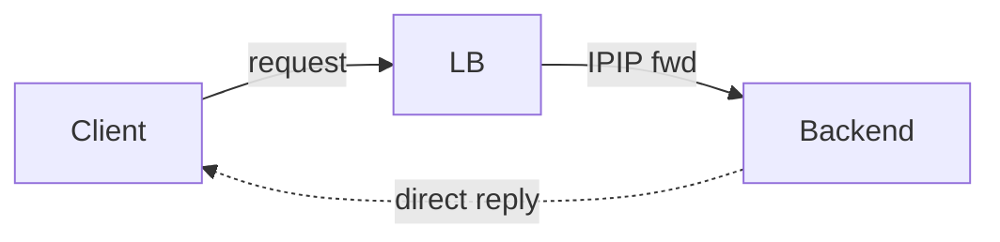
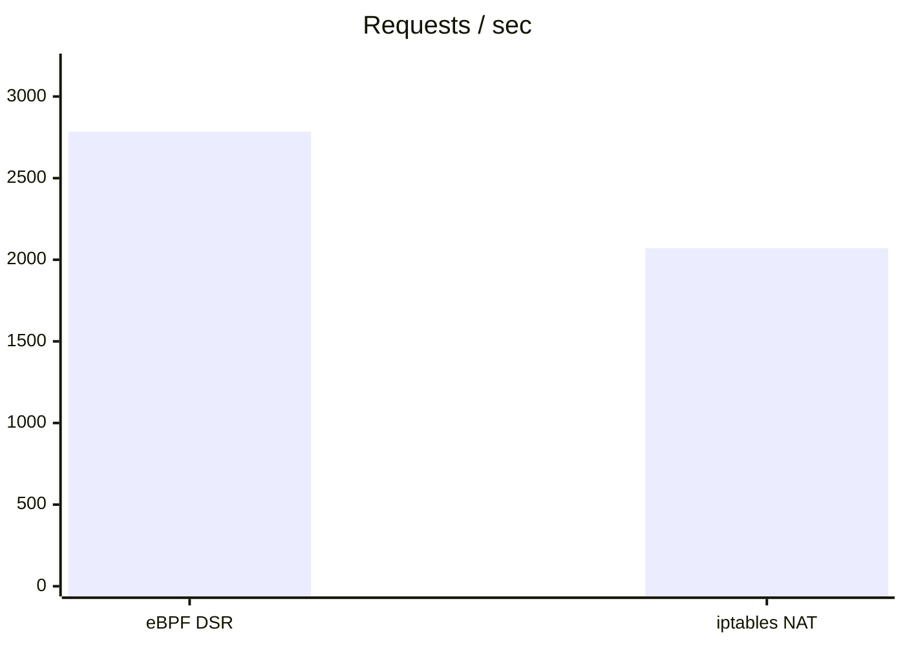
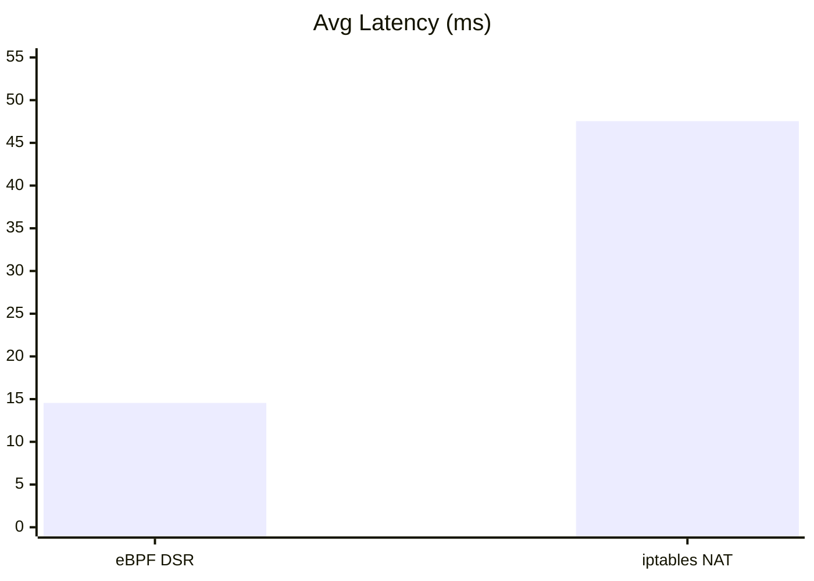
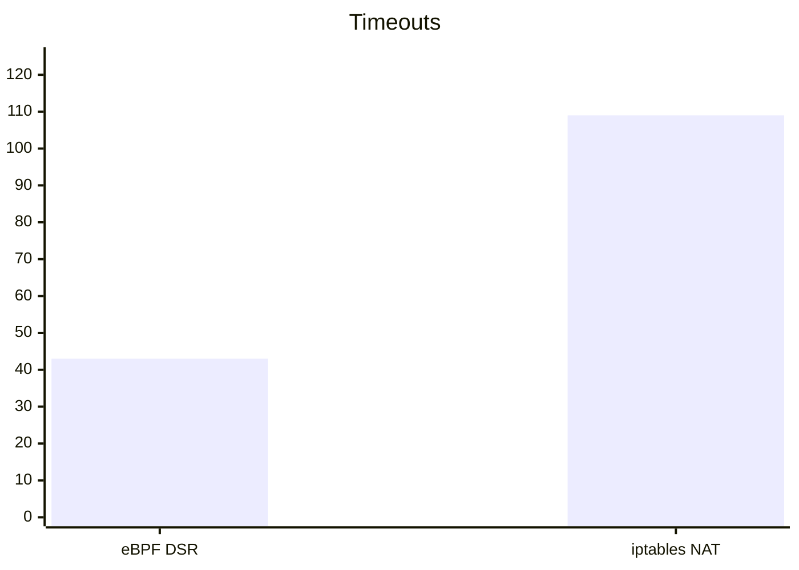
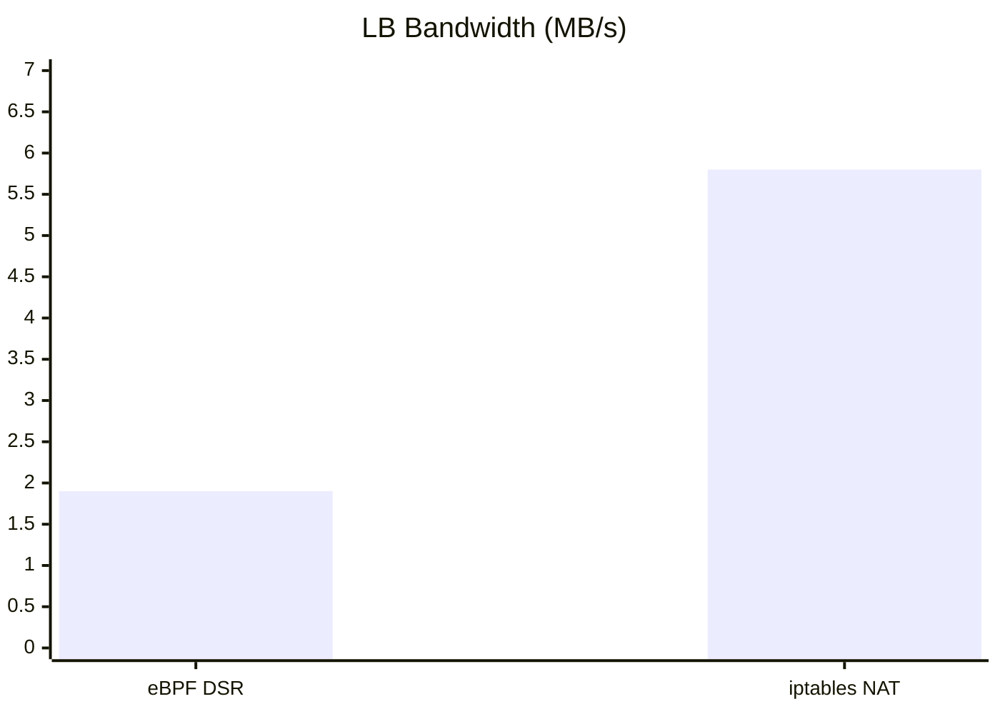
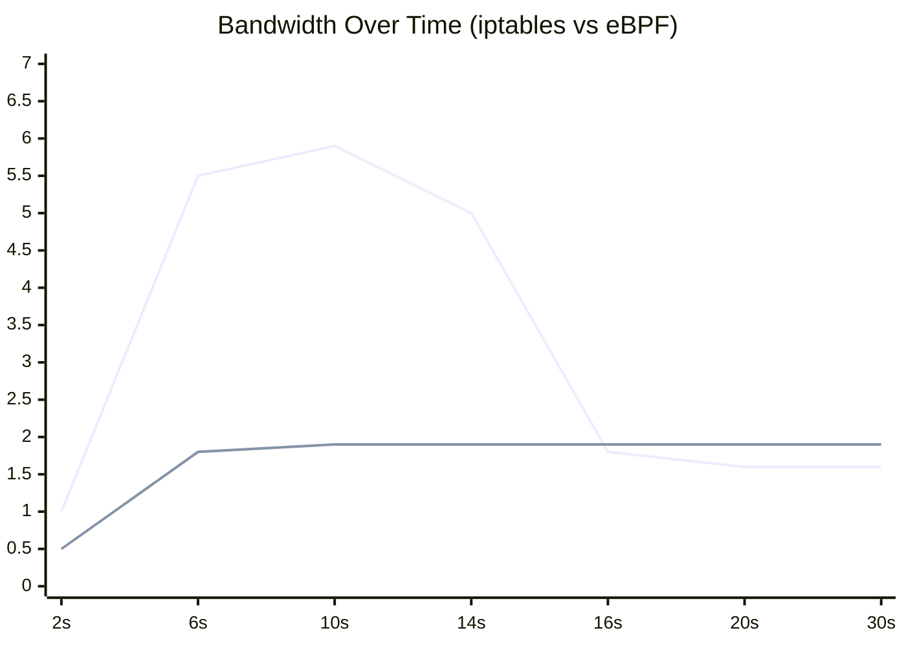
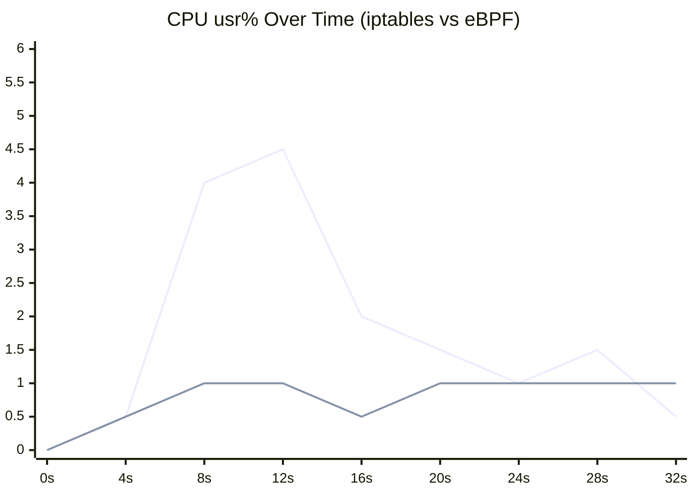

[Part one](/blog/post.html?slug=l4-loadbalancer) was about building them. This is about performance measurement.

I pointed `wrk` at both load balancers — same hardware, same backends, same test duration — and collected everything: throughput, latency, timeouts, CPU, bandwidth. The eBPF one won every metric.

---

## Test Setup

```
wrk -t4 -c400 -d30s http://<LB_IP>:8000/
```

| Field                 | Value                                |
| --------------------- | ------------------------------------ |
| Test duration         | 30 seconds                           |
| Threads / connections | 4 threads · 400 connections          |
| LB spec               | 2 vCPU · 4 GB RAM                    |
| Backends              | 2 × (2 vCPU · 4 GB RAM) on port 8000 |
| eBPF mode             | XDP generic + IPIP encapsulation     |
| iptables mode         | NAT full proxy (DNAT + SNAT)         |
| Kernel                | 6.1.167 · Ubuntu Noble 24.04         |

Both backends run a simple HTTP server. The test exercises the full path end to end: client connection → LB → backend → response back.

---

## Architecture Recap

The two paths are fundamentally different in where the LB sits on the return path. This explains almost every number below.

**eBPF — Direct Server Return**



**iptables — Full Proxy**


The eBPF LB only handles inbound packets. The backend replies directly to the client — the LB never sees return traffic. The iptables LB is on the critical path for both directions: every byte of response goes back through it, gets SNATted, gets forwarded. At small scale the difference is manageable. At any real scale the iptables LB's bandwidth doubles the eBPF LB's just by architecture.

---

## The Numbers

| Metric           | eBPF DSR      | iptables NAT | Delta         |
| ---------------- | ------------- | ------------ | ------------- |
| Requests/sec     | **2,785**     | 2,071        | +34% eBPF     |
| Total reqs/30s   | **83,730**    | 61,741       | +36% eBPF     |
| Avg latency      | **14.55ms**   | 47.54ms      | 3.3× faster   |
| Latency stdev    | **81.93ms**   | 93.96ms      | −13% eBPF     |
| Max latency      | 1.70s         | 1.71s        | equal         |
| Timeouts         | **43**        | 109          | 2.5× fewer    |
| Transfer/sec     | **2.62 MB/s** | 1.95 MB/s    | +34% eBPF     |
| LB CPU avg       | **~1%**       | ~2–5%        | lower eBPF    |
| LB net bandwidth | **~1.9 MB/s** | ~5.8 MB/s    | 3× lower eBPF |

---

## Throughput



34% more requests per second with default settings. The iptables LB processes every packet twice — once on ingress through the DNAT chain, once on egress through SNAT. The eBPF LB processes each connection's inbound packets and never sees the response. Stack traversal aside, that alone explains most of the gap.

---

## Latency



3.3× faster average latency. The iptables LB adds roughly 33ms per request. That's not just network stack overhead — it's conntrack entry lookup, NAT rule evaluation on ingress, conntrack reverse lookup, SNAT rule evaluation on egress. Every request touches the NAT table four times total.

---

## Timeouts



109 timeouts on iptables vs 43 on eBPF. This is where conntrack pressure shows up most visibly. The timeouts aren't random — they correlate with the bandwidth degradation that starts around second 10 of the test.

---

## LB Bandwidth



The eBPF LB moves 1.9 MB/s. The iptables LB moves 5.8 MB/s — **for the same workload**. The iptables LB is carrying request traffic in and response traffic out. The eBPF LB only carries the requests; the responses go from backend directly to client. At scale this matters a lot: larger responses or higher concurrency would exhaust the iptables LB's NIC bandwidth long before the eBPF LB gets close.

---

## The Conntrack Problem

`wrk` with 400 connections at 2000+ req/s generates connections fast. Each one creates a conntrack entry.`nf_conntrack` is a global hash table with per-bucket spinlocks — as the table fills under sustained load, threads contend on those locks, requests start timing out, and throughput degrades.

This is visible in the bandwidth trace:



iptables (top line) ramps up hard, peaks around 5.9 MB/s, holds there until second 14, then cliff drops to ~1.6 MB/s and flatlines. eBPF (bottom line) ramps up once, settles at 1.9 MB/s, never moves again. The irony is iptables ends up _below_ eBPF after the drop — all that bandwidth carrying return traffic, and it still loses. That cliff is conntrack spinlock contention hitting the wall as the table saturates.

The eBPF conntrack map doesn't have this problem for two reasons. First, it's `BPF_MAP_TYPE_LRU_HASH` — per-CPU, no global lock, O(1) lookup, auto-evicts when full. Second, entries get cleaned up immediately on FIN or RST rather than waiting for a timer:

```c
if (tcp->fin || tcp->rst)
    bpf_map_delete_elem(&conntrack, &ckey);
```

---

## CPU Is Fine on Both Sides

Neither LB was CPU-bound — but the shape of iptables CPU usage tells the same story as the bandwidth chart.



iptables (top line) spikes up to 4–5% during the conntrack saturation window (8–16s), then falls off a cliff alongside the bandwidth — the conntrack pressure that was burning CPU just disappears when the table stops growing. eBPF (bottom line) stays flat under 1% the entire run. Both LBs have plenty of headroom. The gap is architectural, not a CPU limit being hit.

---

## The Real Bottleneck

Both LBs show high latency stdev (~82–94ms) and nearly identical max latency (~1.7s). When the tail is the same across both and stdev is high everywhere, the bottleneck is behind the LB. Each backend is 2 vCPU handling 200 connections under sustained load — they queue. The LB can forward faster, but there's nowhere for the packets to go faster.

Confirming this would require scaling the backends out and re-running. At lower concurrency or with more backend capacity, the relative eBPF advantage would likely grow: less conntrack pressure, less backend queuing, the architectural difference dominates more cleanly.

Also, we're not benchmarking the backend. It's a dummy Python HTTP server. Backend chokes? I missed the part where that's my problem.

## Summary

eBPF wins on every number: 34% more throughput, 3.3× lower latency, 2.5× fewer timeouts, 3× less bandwidth on the LB node. The iptables LB degrades under sustained load due to conntrack table pressure that would improve significantly with better timeout settings. The eBPF LB stays flat throughout.

The gap breaks down roughly as: half of it is DSR (eBPF never handles return traffic), a third is conntrack implementation quality (BPF LRU vs kernel hash table with global spinlocks), and the rest is stack bypass. At higher concurrency all three factors amplify.

---

My crappy slop eBPF code beat my other crappy slop iptables wrapper by 34% and 3.3× — both are bad, but differences are visible. Now imagine someone actually competent with the same design.
