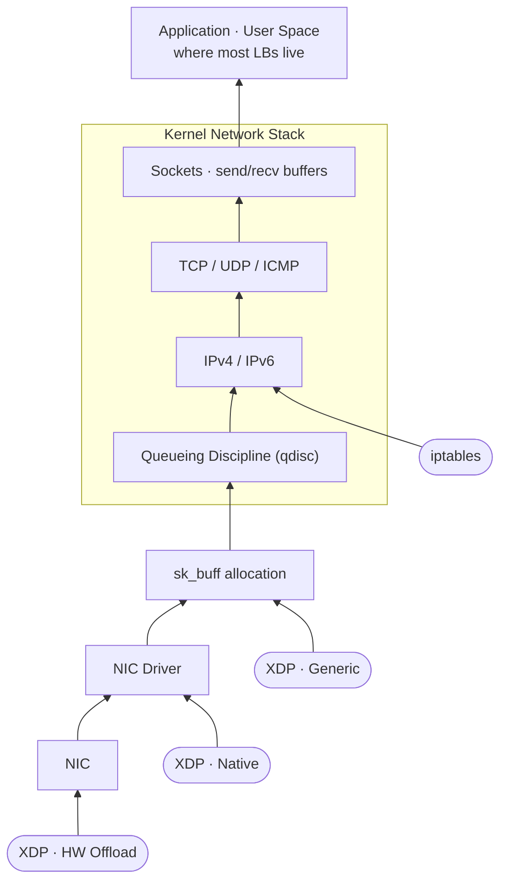

# I Built Two L4 Load Balancers Because One Wasn't Enough to Confuse Me

---



---

## The iptables One

I was messing around with Docker networking and Kubernetes one day and kept seeing `iptables` rules everywhere — in `kube-proxy`, in Docker's bridge network, in every "how does this actually work" rabbit hole I fell into. Turns out a big chunk of what makes container networking work is just NAT rules that the kernel evaluates on every packet. I figured building a load balancer on top of iptables would be the fastest way to actually understand what those rules do.

The result is [iptablelb4](https://github.com/Sithukyaw666/iptablelb4). It's a Go service with a REST API that manages iptables rules so you don't have to type them by hand and inevitably get the order wrong.

The architecture is the full proxy model: **client → LB → backend → LB → client**. Everything goes through the LB in both directions. The NAT table is doing two jobs. On the way in, `PREROUTING` with `DNAT` rewrites the destination IP from the LB's IP to the backend. On the way out, `POSTROUTING` with `MASQUERADE` rewrites the source IP back to the LB's IP so the client thinks the response came from the right place. The kernel handles all of this. My code just installs the rules.

Each "server farm" gets its own custom chain in the NAT table, which then gets jumped to from `PREROUTING`. This keeps things clean — deleting a farm means clearing its chain and removing the jump, nothing else touched.

The actual rule generation looks like this:

```go
func GenerateIptablerules(index, length int, dip, dport, algorithm, port string) ([]string, []string) {
    destination := fmt.Sprintf("%s:%s", dip, dport)
    traffic := fmt.Sprintf("%v", length-index)
    probability := fmt.Sprintf("%v", (math.Floor(float64(100)/float64(length-index)))/100)

    egress := []string{
        "-d", dip, "-p", "tcp", "-m", "tcp",
        "--dport", dport, "-j", "MASQUERADE",
    }

    if algorithm == "round-robin" {
        ingress = []string{
            "-p", "tcp", "--match", "statistic",
            "--mode", "nth", "--every", traffic,
            "--dport", port, "--packet", "0",
            "-j", "DNAT", "--to-destination", destination,
        }
    } else {
        ingress = []string{
            "-p", "tcp", "--match", "statistic",
            "--mode", "random", "--probability", probability,
            "--dport", port, "-j", "DNAT", "--to-destination", destination,
        }
    }
    return ingress, egress
}
```

For round-robin it uses `--mode nth --every N` where N counts down from the total number of backends. The first rule matches every `N`th packet, the second every `N-1`th, and so on. For random it uses `--mode random --probability P` where P is `1 / (remaining backends)` at each step — first backend gets 0.5, second gets 1.0 — statistically equal share.

The bottleneck is obvious: the LB sits on the critical path for both directions. All response traffic goes back through it. For internal low-throughput stuff it's fine. For anything that actually moves data it becomes a bottleneck fast.

---

## The eBPF One

I was reading about Cilium — one of the CNI plugins for Kubernetes — and noticed it replaces `kube-proxy` entirely. Instead of iptables rules that the kernel evaluates on every packet all the way up the network stack, Cilium hooks in at the XDP layer and processes packets before the stack even sees them. High performance, low overhead, no NAT table traversal. I wanted to understand how that worked, so I built [ebpf-lb](https://github.com/Sithukyaw666/ebpf-lb).

I would not have been able to build this without [Teodor Janez Podobnik's eBPF tutorial series at iximiuz labs](https://labs.iximiuz.com/tutorials). I did not know enough to build it from scratch on my own. I still don't fully know what I'm doing, but I know considerably more than I did before going through that material.

It's an XDP program — eXpress Data Path. The BPF program attaches to the network interface's XDP hook and runs before the kernel networking stack processes the packet at all. I'm using generic mode, which runs after the driver but before the stack — visible in the diagram above. Not native mode, which would run inside the NIC driver and is faster, but requires driver support I wasn't going to bother setting up.

The architecture is DSR — **Direct Server Return**. The LB only handles the inbound direction. The backend replies directly to the client without going back through the LB. **Client → LB → backend**, then **backend → client**. The LB is not on the return path, which is almost always the heavy direction. This is what makes it actually scale compared to the iptables version.

### XDP Program Structure

The XDP program entry point is tagged `SEC("xdp")` and receives an `xdp_md` context — basically just pointers to the start and end of the packet buffer. Every pointer access needs a bounds check or the BPF verifier rejects the program at load time.

```c
SEC("xdp")
int xdp_loadbalancer(struct xdp_md *ctx) {
    void *data_end = (void *)(long)ctx->data_end;
    void *data     = (void *)(long)ctx->data;
    struct hdr_cursor nh = { .pos = data };

    struct ethhdr *eth;
    int eth_type = parse_ethhdr(&nh, data_end, &eth);
    if (eth_type != bpf_htons(ETH_P_IP))
        return XDP_PASS;

    struct iphdr *ip;
    parse_iphdr(&nh, data_end, &ip);
    if ((void *)(ip + 1) > data_end || ip->protocol != IPPROTO_TCP)
        return XDP_PASS;

    struct tcphdr *tcp;
    parse_tcphdr(&nh, data_end, &tcp);
    if ((void *)(tcp + 1) > data_end)
        return XDP_PASS;

    // conntrack, IPIP encapsulation, FIB lookup, XDP_TX ...
}
```

Non-IPv4 packets and non-TCP packets get `XDP_PASS` — handed to the kernel to deal with normally. Everything else the program handles itself.

### Conntrack

TCP is a 3-way handshake. Client sends SYN, server replies with SYN-ACK, client completes with ACK. If you naively round-robin at the packet level, the SYN goes to backend 1 and the ACK goes to backend 2. Backend 2 has no idea what's going on — it never saw the SYN. The handshake is broken before any data is transferred. Every connection dies immediately.

So every connection gets pinned to one backend for its lifetime. The conntrack map is an `LRU_HASH` keyed on the 4-tuple:

```c
struct conn_key {
    __u32 src_ip;
    __u32 dst_ip;
    __u16 src_port;
    __u16 dst_port;
};

struct {
    __uint(type, BPF_MAP_TYPE_LRU_HASH);
    __uint(max_entries, 65536);
    __type(key,   struct conn_key);
    __type(value, __u32);           // backend index
} conntrack SEC(".maps");
```

`max_entries` is 65536 because that's the source port range — each TCP connection a client opens gets a unique source port, so a single client can have at most that many simultaneous connections. LRU evicts the oldest entry when the map is full automatically, no explicit TTL needed.

The lookup and pinning logic in the XDP program:

```c
struct conn_key ckey = {
    .src_ip   = ip->saddr,
    .dst_ip   = ip->daddr,
    .src_port = tcp->source,
    .dst_port = tcp->dest,
};

__u32 backend_idx;
__u32 *stored_idx = bpf_map_lookup_elem(&conntrack, &ckey);

if (stored_idx) {
    backend_idx = *stored_idx;
    if (tcp->fin || tcp->rst)
        bpf_map_delete_elem(&conntrack, &ckey);  // evict on teardown
} else {
    if (!tcp->syn)
        return XDP_PASS;  // mid-session with no record, pass to kernel

    if (get_next_backend_idx(&backend_idx) < 0)
        return XDP_ABORTED;

    bpf_map_update_elem(&conntrack, &ckey, &backend_idx, BPF_ANY);
}
```

Only `SYN` creates a new entry. `FIN` or `RST` deletes it. Anything else with no existing entry is mid-session traffic that arrived after an eviction — passed to the kernel.

### Making DSR Work Across Networks

The naive approach is to just rewrite the destination IP to the backend's IP and send it. The problem is the client sent a packet to the LB's IP. When the backend replies, the source IP in the response will be the backend's IP, not the LB's. The client sees a response from an IP it never talked to and drops it.

One option is a virtual IP with MAC rewriting — the LB and all backends share the same VIP, and instead of rewriting the destination IP you only rewrite the destination MAC address. The packet gets _switched_, not routed. The backend receives it, sees its own MAC, sees the VIP as the destination IP (which it also owns), processes the request, and replies from the VIP. Client is happy. The catch is this only works if the LB and all backends are in the same layer 2 network, because MAC rewriting only gets you so far — you can't cross a router with this.

Another option is IPIP encapsulation. The LB wraps the original client packet inside a new outer IP header — LB's IP as source, backend's IP as destination. On the backend side, the kernel IPIP module needs to be loaded (`modprobe ipip`). When the encapsulated packet arrives, the IPIP module sees `protocol = IPPROTO_IPIP` in the outer header, strips it, and hands the original inner packet up the stack. That inner packet still has the client's source IP and the LB's VIP as destination. The backend replies directly to the client's IP with the VIP as source. Client is satisfied. And because the routing is done at L3 with real IP headers, the LB and backends don't need to be in the same L2 network — this one is the better option for that reason.

This is what the eBPF LB uses. The program calls `bpf_xdp_adjust_head(ctx, -20)` to prepend room for the outer header — negative delta moves the `data` pointer left, expanding the headroom. After that all existing pointers are invalid and must be recomputed.

```c
int adj = bpf_xdp_adjust_head(ctx, 0 - (int)sizeof(struct iphdr));
if (adj < 0) return XDP_ABORTED;

// recompute all pointers — old ones are stale
void *new_data     = (void *)(long)ctx->data;
void *new_data_end = (void *)(long)ctx->data_end;

struct ethhdr *new_eth = new_data;
struct iphdr  *outer   = (void *)(new_eth + 1);
struct iphdr  *inner   = (void *)(outer   + 1);

// bounds-check everything the verifier requires
if ((void *)(inner + 1) > new_data_end) return XDP_ABORTED;

// build the outer IP header from scratch
outer->version  = 4;
outer->ihl      = 5;
outer->ttl      = 64;
outer->protocol = IPPROTO_IPIP;   // tells the backend's IPIP module to decapsulate
outer->tot_len  = bpf_htons(bpf_ntohs(inner->tot_len) + sizeof(struct iphdr));
outer->saddr    = lb->ip;
outer->daddr    = backend->ip;
outer->check    = recalc_ip_checksum(outer);
```

The checksum on the outer header has to be computed by hand. The IP checksum is a 16-bit one's complement sum of the header. `bpf_csum_diff` handles the summation but returns a 64-bit accumulator, so carry bits have to be folded back in manually:

```c
static __always_inline __u16 recalc_ip_checksum(struct iphdr *ip) {
    ip->check = 0;
    __u64 csum = bpf_csum_diff(NULL, 0, (unsigned int *)ip, sizeof(struct iphdr), 0);
    #pragma unroll
    for (int i = 0; i < 4; i++) {
        if (csum >> 16)
            csum = (csum & 0xffff) + (csum >> 16);
    }
    return ~csum;
}
```

Four iterations because carry can cascade. `#pragma unroll` because the BPF verifier does not allow loops it can't reason about statically.

The ethernet FCS does _not_ need to be recalculated after updating the MAC addresses. The NIC hardware recomputes it automatically on transmit.

### Routing and MAC Rewriting

The packet needs correct MAC addresses or it goes nowhere. `bpf_fib_lookup` does a kernel FIB lookup from inside the BPF program — you give it the source and destination IPs and it gives back the next-hop MAC addresses.

```c
static __always_inline int fib_lookup_v4_full(struct xdp_md *ctx,
                                              struct bpf_fib_lookup *fib,
                                              __u32 src, __u32 dst,
                                              __u16 tot_len) {
    __builtin_memset(fib, 0, sizeof(*fib));
    fib->family        = AF_INET;
    fib->ipv4_src      = src;
    fib->ipv4_dst      = dst;
    fib->l4_protocol   = IPPROTO_TCP;
    fib->tot_len       = tot_len;
    fib->ifindex       = ctx->ingress_ifindex;
    return bpf_fib_lookup(ctx, fib, sizeof(*fib), 0);
}
```

On success, `fib.smac` and `fib.dmac` have the correct MAC addresses. You copy those into the ethernet header and the packet is ready to go.

Since this is just a PoC there's no health checking and no dynamic backend updates. If `bpf_fib_lookup` returns `BPF_FIB_LKUP_RET_NO_NEIGH` it means there's no ARP entry for the next hop — fix it by pinging the backend first to populate the neighbor cache.

### The Endianness Thing

This one got me. On the Go side, backend IPs get stored into an eBPF map as `uint32`. I had no idea endianness was a thing I needed to think about. I picked `binary.BigEndian.Uint32` because, I don't know, bigger sounds better. Got the bug. IPs were going out wrong and nothing told me why. I dug around, searched, and eventually learned that endianness exists and that I had been completely ignoring it.

Both functions read the same input bytes. The difference is which byte they treat as most significant. `To4("10.0.0.2")` gives you `[0x0A][0x00][0x00][0x02]`. `BigEndian.Uint32` reads `[0]` as MSB and produces `0x0A000002`. `LittleEndian.Uint32` reads `[0]` as LSB and produces `0x0200000A`. Different values from the same bytes.

After that, both values get written to the eBPF map with respect to host endianness — mine is little-endian, LSB at address `[0]`.

**With BigEndian:**

```
BigEndian.Uint32([0x0A][0x00][0x00][0x02]) = 0x0A000002

written to map (little-endian, LSB first):
  [0]   [1]   [2]   [3]
  0x02  0x00  0x00  0x0A
```

C reads those bytes back as little-endian: `0x0A000002`. Then assigns `outer->daddr = 0x0A000002`. Writing that back to packet memory on a little-endian machine:

```
  [0]   [1]   [2]   [3]
  0x02  0x00  0x00  0x0A
```

The NIC reads packet bytes sequentially in network order (big-endian): `0x02.0x00.0x00.0x0A` = **2.0.0.10** ✗

Why does the NIC not just read right to left to compensate? Because it doesn't know about your host's endianness. Network byte order is always big-endian — that's the spec, hardwired into every protocol. The NIC reads memory left to right, `[0]` first, and whatever bytes are sitting there get sent on the wire in that order. The CPU's little-endian layout reversed your IP when writing it to memory, and the NIC has no idea, no reason to care, and nowhere to correct it. The bytes go out wrong and stay wrong.

**With LittleEndian:**

```
LittleEndian.Uint32([0x0A][0x00][0x00][0x02]) = 0x0200000A

written to map (little-endian, LSB first):
  [0]   [1]   [2]   [3]
  0x0A  0x00  0x00  0x02
```

C reads back `0x0200000A`. Assigns `outer->daddr = 0x0200000A`. Written to packet memory:

```
  [0]   [1]   [2]   [3]
  0x0A  0x00  0x00  0x02
```

NIC reads: `0x0A.0x00.0x00.0x02` = **10.0.0.2** ✓

The value `0x0200000A` looks wrong — reversed — but the bytes that land in the packet are correct. The LittleEndian encoding "pre-reversed" the integer so that writing it back to little-endian packet memory undoes the reversal.

A useful sanity check: in the BPF program you can print the IP byte by byte, shifting through the value:

```c
bpf_printk("ip: %d.%d.%d.%d",
    (backend->ip)        & 0xFF,
    (backend->ip >>  8)  & 0xFF,
    (backend->ip >> 16)  & 0xFF,
    (backend->ip >> 24)  & 0xFF);
```

The shifts read the integer byte by byte in host byte order — `& 0xFF` gives the byte at memory address `[0]`, `>> 8 & 0xFF` gives `[1]`, and so on. So instead of printing the raw hex value (which looks confusing), you get the bytes in the order the host actually sees them. If the encoding matches the host, the octets come out in the right order. LittleEndian (`0x0200000A`) → `0x0A, 0x00, 0x00, 0x02` = 10.0.0.2 ✓. BigEndian (`0x0A000002`) → `0x02, 0x00, 0x00, 0x0A` = 2.0.0.10 ✗. If `bpf_printk` prints it reversed, the encoding is wrong.

Rule of thumb: if you know your host is little-endian, use `LittleEndian`. If it's big-endian, use `BigEndian`. If you don't know, just use `binary.NativeEndian` — Go picks the right one for the host automatically, which is what I ended up doing.

In the C side, comparisons against values in packet headers use `bpf_htons` and `bpf_ntohs` to convert between host byte order and network byte order. The two concerns — map storage encoding and packet field conversion — are related but separate. Mixing them up gives you bugs that look random until they don't.

---

## Which One Is Better

The iptables one is simpler to understand and simpler to run. The kernel does all the packet work and my code is just a REST API that manages rules. It's basically a wrapper around the iptables CLI. Good for understanding how Docker and kube-proxy work under the hood.

The eBPF one hook below the network stack, handle packets before the kernel touches them, skip the NAT table entirely. The LB is off the return path so it actually scales.

Neither one handles health checks. Why?, i don't know, it's poc , shut up.

---

Just use nginx and call it a day.
